# Dungeon Explorer — Technical Documentation

> **Version:** 1.0.0 | **Last Updated:** 2024 | **Author:** Dungeon Explorer Team

---

## Table of Contents

1. [Project Overview](#1-project-overview)
2. [Architecture Overview](#2-architecture-overview)
3. [Component Deep Dive](#3-component-deep-dive)
4. [Data Flow Diagrams](#4-data-flow-diagrams)
5. [AI Integration](#5-ai-integration)
6. [Game Systems](#6-game-systems)
7. [Network Protocol](#7-network-protocol)
8. [Configuration Reference](#8-configuration-reference)
9. [API / Command Reference](#9-api--command-reference)
10. [Deployment Guide](#10-deployment-guide)
11. [Testing Strategy](#11-testing-strategy)
12. [Contributing](#12-contributing)

---

## 1. Project Overview

Dungeon Explorer is a **real-time multiplayer terminal RPG** built on a TCP socket server. Players connect via a CLI client, are assigned a persistent session, and explore a procedurally narrated dungeon powered by Google Gemini AI. The server maintains shared world state, per-player context windows, and routes all commands through a clean handler architecture.

### Technology Stack

| Layer | Technology |
|---|---|
| Runtime | Python 3.11+ |
| AI | Google Gemini 1.5 Flash via `google-generativeai` SDK |
| Networking | Python `socket` (TCP) + `threading` |
| Config | `python-dotenv` |
| Terminal UI | `colorama`, Unicode box-drawing characters |
| Containerisation | Docker + Docker Compose |
| Task Runner | Taskfile v3 |
| CI/CD | GitHub Actions |

---

## 2. Architecture Overview

### High-Level System Architecture

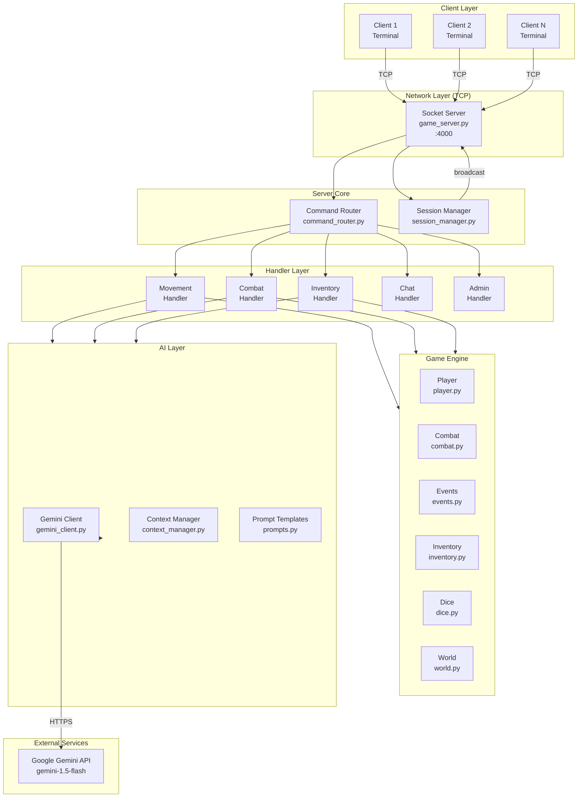

### Module Dependency Graph

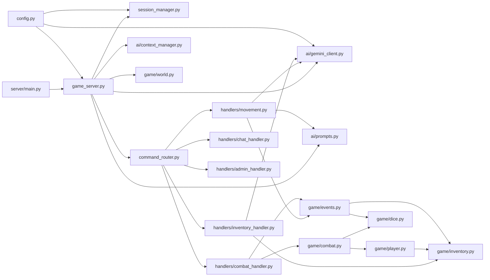

---

## 3. Component Deep Dive

### 3.1 `game_server.py` — TCP Server

The entry-point for all network operations. Responsibilities:

- Binds a TCP socket to `HOST:PORT`
- Accepts incoming connections, spawning one `threading.Thread` per player
- Sends the ASCII welcome banner and prompts for player name
- Triggers the initial AI floor generation
- Runs the per-client **receive → route → respond** loop
- Handles disconnection cleanup via `_cleanup()`

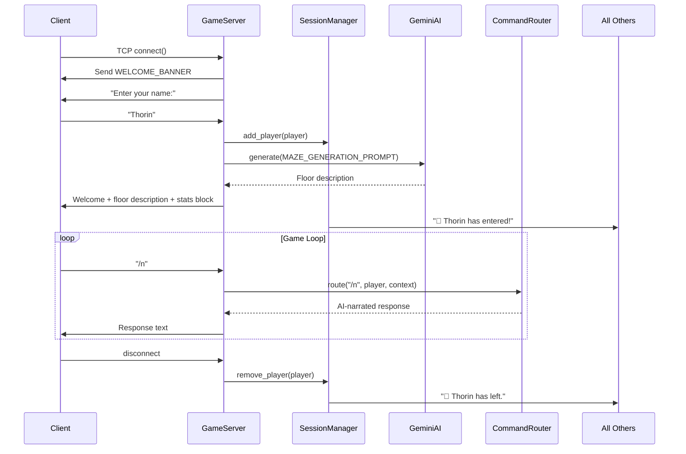

### 3.2 `session_manager.py` — Session Registry

A thread-safe in-memory store mapping:
- `player_id (str)` → `Player` object
- `socket.fileno() (int)` → `player_id`

Key operations:

| Method | Description |
|---|---|
| `add_player(player)` | Register a new connection |
| `remove_player(player)` | Unregister on disconnect |
| `broadcast(msg, exclude)` | Send to all players, optionally excluding one |
| `leaderboard()` | Sorted snapshot by level + XP |

### 3.3 `command_router.py` — Command Dispatch

Routes raw string input to the appropriate handler. Applies two guards before dispatch:

1. **Death guard** — dead players can only `/respawn` or `/help`
2. **Combat guard** — players in combat can only use combat/inventory/help commands

Free-form input (no `/` prefix) is passed directly to Gemini as narrative action.

### 3.4 `ai/gemini_client.py` — Gemini Wrapper

A **singleton** wrapping `google.generativeai.GenerativeModel`. Initialised once at server startup with the `SYSTEM_PROMPT` as a system instruction.

Two modes of generation:
- **Stateless**: `generate(prompt)` — for world/floor generation
- **Stateful**: `generate(prompt, history=context.get_history())` — uses per-player rolling context

### 3.5 `ai/context_manager.py` — Per-Player Memory

Each player gets their own `PlayerContext` instance holding:
- A `deque(maxlen=20)` of `{role, parts}` dicts (the Gemini conversation format)
- A `dungeon_summary` string — the last 300 chars of AI output used as world context in future prompts

This prevents cross-player AI contamination and manages token budget via the rolling window.

### 3.6 `game/player.py` — Player State

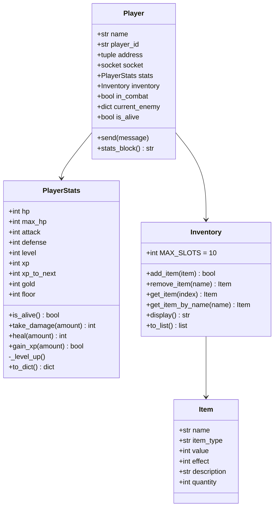

---

## 4. Data Flow Diagrams

### 4.1 Movement Command Flow

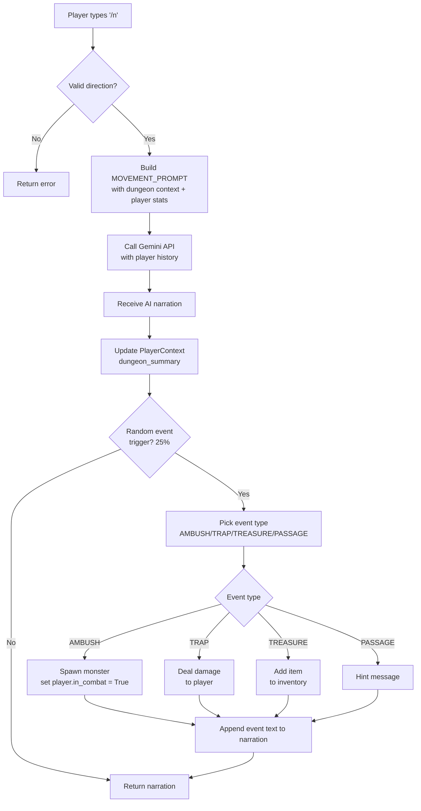

### 4.2 Combat Round Flow

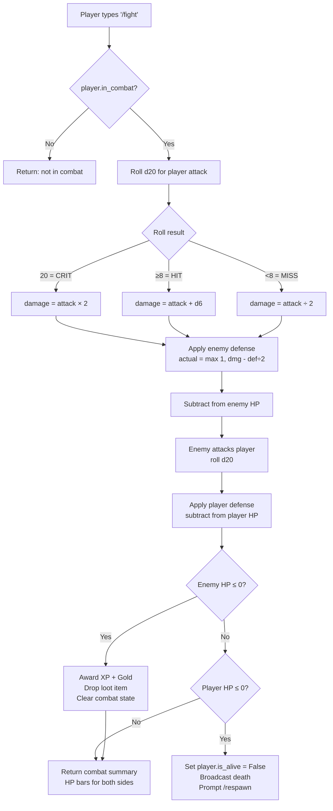

### 4.3 AI Prompt Lifecycle

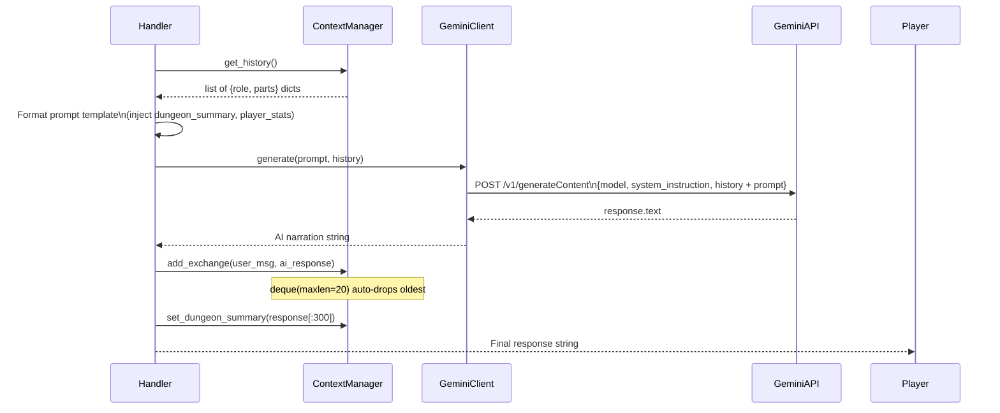

---

## 5. AI Integration

### 5.1 Model Configuration

```
Model:              gemini-1.5-flash
System instruction: SYSTEM_PROMPT (DM persona + world rules)
Context window:     Rolling 20 messages per player
Temperature:        Default (0.9) — creative but coherent
Max output tokens:  Default (Gemini manages)
```

### 5.2 Prompt Templates

| Prompt | Trigger | Key Variables |
|---|---|---|
| `SYSTEM_PROMPT` | Model init (once) | — (static DM persona) |
| `MAZE_GENERATION_PROMPT` | `/new_floor`, first login | — |
| `MOVEMENT_PROMPT` | `/n /s /e /w` | `dungeon_context`, `player_stats`, `direction` |
| `COMBAT_PROMPT` | (future enhancement) | `player_stats`, `enemy` |
| `ITEM_USE_PROMPT` | `/use <item>` | `item_name`, `player_stats`, `context` |

### 5.3 AI Signal Parsing

AI responses embed signal tokens that handlers parse to trigger game mechanics:

| Token | Handler | Effect |
|---|---|---|
| `DEAD_END` | movement.py | No event triggered, narration only |
| `EVENT: AMBUSH` | movement.py | Force spawns a monster |
| `EVENT: TRAP` | movement.py | Force triggers trap damage |
| `HP_RESTORED: <n>` | inventory_handler.py | Heals player by n HP |
| `WEAPON_EQUIPPED: <name>` | inventory_handler.py | Adds item.effect to player.attack |
| `PLAYER_DIED` | (future) | Narrate death (currently handled by HP check) |
| `ENEMY_DEFEATED` | (future) | Narrate victory (currently handled by HP check) |

### 5.4 Context Isolation

Each player maintains a completely independent `PlayerContext`. There is **no shared AI history** between players. This means:

- Player A's dungeon narrative does not affect Player B's AI responses
- Token costs scale linearly with player count (not quadratically)
- Players can be on different floors with entirely different world states

---

## 6. Game Systems

### 6.1 Combat System

Combat uses a simplified **d20 system**:

```
Attack roll = d20()
  20        → Critical hit  (damage × 2)
  8–19      → Hit           (damage + d6)
  1–7       → Glancing blow (damage ÷ 2)

Actual damage = max(1, raw_damage − (defender_defense ÷ 2))
```

Flee mechanic: 40% success rate. On failure, the enemy gets a free attack.

### 6.2 Event System

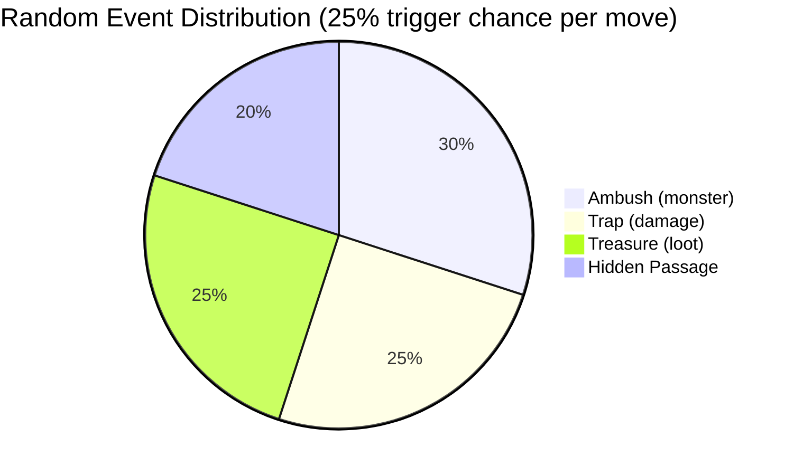

### 6.3 Loot System

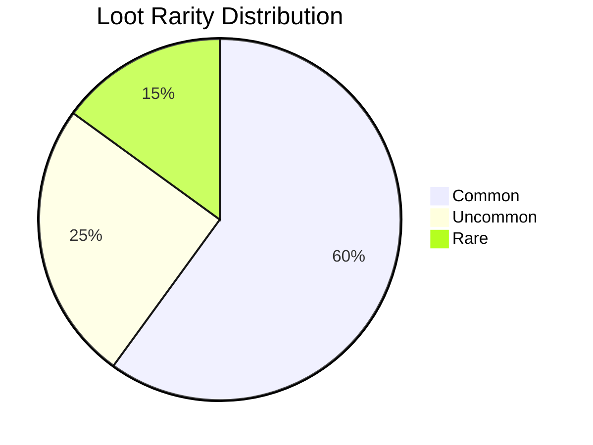

Monster difficulty scales with `floor` number:
```
hp     = base_hp     × (1 + (floor − 1) × 0.15)
attack = base_attack × (1 + (floor − 1) × 0.15)
xp     = base_xp     × (1 + (floor − 1) × 0.15)
```

### 6.4 Leveling Curve

| Level | XP Required | HP | Attack | Defense |
|---|---|---|---|---|
| 1 | 0 | 100 | 10 | 5 |
| 2 | 100 | 115 | 13 | 7 |
| 3 | 150 | 130 | 16 | 9 |
| 4 | 225 | 145 | 19 | 11 |
| 5 | 337 | 160 | 22 | 13 |
| N | prev × 1.5 | +15 per level | +3 per level | +2 per level |

---

## 7. Network Protocol

Dungeon Explorer uses a simple **raw TCP text protocol**. There is no binary framing — messages are UTF-8 strings delimited by newlines.

```
Client → Server:  /fight\n
Server → Client:  ⚔  You strike Goblin for 12 dmg!\n
                  🗡  Goblin hits you for 4 dmg!\n
                  Enemy — HP: 8   |   You — HP: 91/100 (alive)\n
```

**Buffer size:** 4096 bytes per read. Long AI responses may be chunked by the OS; the client's receive loop handles this transparently.

**Encoding:** UTF-8 with `errors='replace'` on decode — handles malformed bytes gracefully.

### Connection Lifecycle

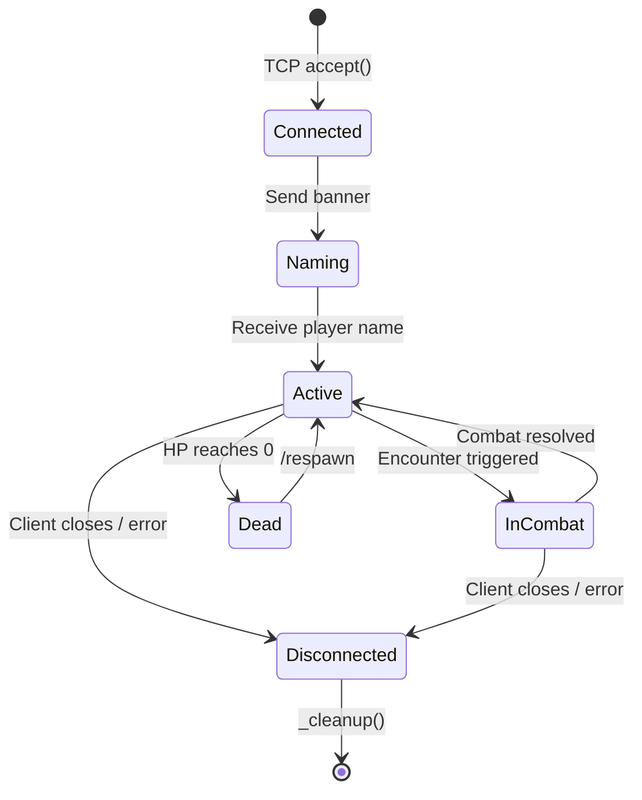

---

## 8. Configuration Reference

All values loaded from `.env` via `python-dotenv`.

| Variable | Type | Default | Required | Description |
|---|---|---|---|---|
| `GEMINI_API_KEY` | string | — | ✅ Yes | Google Gemini API key |
| `PORT` | int | `4000` | No | TCP port to bind |
| `HOST` | string | `localhost` | No | Bind address (`0.0.0.0` for Docker/LAN) |
| `MAX_PLAYERS` | int | `10` | No | Max concurrent player connections |
| `LOG_LEVEL` | string | `INFO` | No | `DEBUG / INFO / WARNING / ERROR` |

Compiled `Config` class constants (not overridable via `.env`):

| Constant | Value | Description |
|---|---|---|
| `BUFFER_SIZE` | `4096` | TCP receive buffer in bytes |
| `AI_MODEL` | `gemini-1.5-flash` | Gemini model identifier |
| `MAX_CONTEXT_MESSAGES` | `20` | Rolling AI history window per player |

---

## 9. API / Command Reference

### Full Command Table

| Command | Args | Guard | AI Call | Description |
|---|---|---|---|---|
| `/n /s /e /w` | — | alive, not combat | ✅ Yes | Move in direction |
| `/look` | — | alive | No | Show dungeon summary |
| `/fight` | — | in_combat | No | Attack current enemy |
| `/flee` | — | in_combat | No | Escape combat (40%) |
| `/respawn` | — | dead | No | Restart after death |
| `/inv` | — | alive | No | Show inventory |
| `/use` | `<item name>` | alive | ✅ Yes | Use/equip item |
| `/msg` | `<text>` | alive | No | Broadcast chat |
| `/w` | `<name> <text>` | alive | No | Whisper to player |
| `/who` | — | alive | No | List online players |
| `/stats` | — | alive | No | Show stat block |
| `/roll` | `[sides]` | alive | No | Roll dice (d2–d100) |
| `/new_floor` | — | alive | ✅ Yes | Descend to next floor |
| `/leaderboard` | — | alive | No | Top 10 rankings |
| `/help` | — | always | No | Show help menu |
| `<free text>` | — | alive, not combat | ✅ Yes | Free-form AI action |

### Combat Guards

Commands blocked during combat (must fight or flee first):
`/n`, `/s`, `/e`, `/w`, `/look`, `/msg`, `/w`, `/who`, `/stats`, `/roll`, `/new_floor`, `/leaderboard`

---

## 10. Deployment Guide

### Local Development

```bash
task setup      # First time
task server     # Start server
task client     # Connect client
```

### Production (Linux VPS)

```bash
# 1. Clone and install
git clone https://github.com/yourusername/dungeon-explorer.git
cd dungeon-explorer
python3 -m venv .venv && source .venv/bin/activate
pip install -r requirements.txt

# 2. Configure
cp .env.example .env
nano .env   # Set GEMINI_API_KEY, HOST=0.0.0.0

# 3. Run as a systemd service
sudo nano /etc/systemd/system/dungeon-explorer.service
```

```ini
# /etc/systemd/system/dungeon-explorer.service
[Unit]
Description=Dungeon Explorer MMORPG Server
After=network.target

[Service]
Type=simple
User=ubuntu
WorkingDirectory=/home/ubuntu/dungeon-explorer
EnvironmentFile=/home/ubuntu/dungeon-explorer/.env
ExecStart=/home/ubuntu/dungeon-explorer/.venv/bin/python -m server.main
Restart=on-failure
RestartSec=5

[Install]
WantedBy=multi-user.target
```

```bash
sudo systemctl daemon-reload
sudo systemctl enable dungeon-explorer
sudo systemctl start dungeon-explorer
sudo systemctl status dungeon-explorer
```

### Docker Compose (Recommended for VPS)

```bash
cp .env.example .env     # Add GEMINI_API_KEY, set HOST=0.0.0.0
docker-compose up -d     # Detached
docker-compose logs -f   # Follow logs
```

### Firewall (UFW)

```bash
sudo ufw allow 4000/tcp
sudo ufw reload
```

Players connect with:
```bash
python -m client.main --host YOUR_SERVER_IP --port 4000
```

---

## 11. Testing Strategy

### Test Layout

```
tests/
├── unit/
│   ├── test_dice.py
│   ├── test_combat.py
│   ├── test_inventory.py
│   ├── test_player.py
│   ├── test_events.py
│   └── test_command_router.py
├── integration/
│   ├── test_session_manager.py
│   └── test_game_server.py
└── conftest.py
```

### Key Test Areas

| Module | What to Test |
|---|---|
| `dice.py` | Roll distribution, crit/miss boundary conditions |
| `combat.py` | Damage calculation, death detection, loot grant |
| `inventory.py` | Stack logic, slot limits, name lookup |
| `player.py` | XP/level-up curve, HP clamping, damage reduction |
| `events.py` | Monster scaling formula, loot rarity distribution |
| `command_router.py` | Guard conditions, unknown command fallback |
| `session_manager.py` | Concurrent add/remove, broadcast exclusion |

### Running Tests

```bash
task test           # All tests
task test:cov       # With coverage (target: >80%)
```

---

## 12. Contributing

### Development Workflow

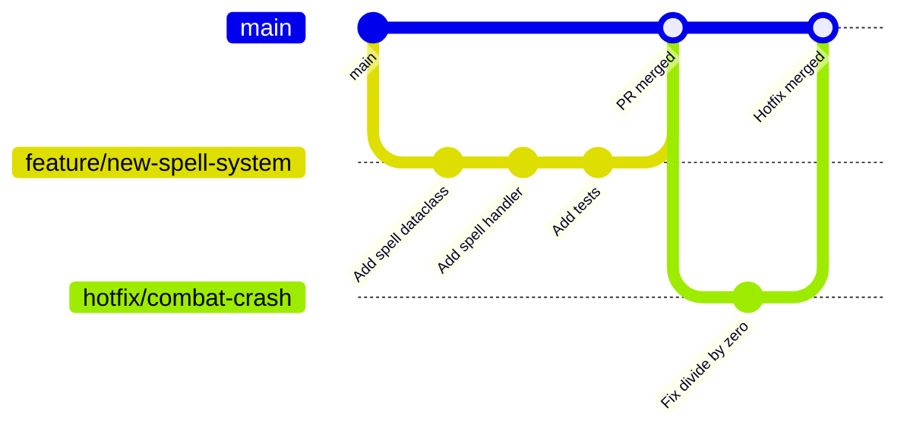

### Pull Request Checklist

- [ ] All tests pass (`task test`)
- [ ] Code passes lint + format (`task check`)
- [ ] New features include tests
- [ ] `DOCUMENTATION.md` updated if architecture changed
- [ ] `.env.example` updated if new config added

### Extending the Game

**Adding a new command:**
1. Add handler function in `server/handlers/<relevant>.py`
2. Register the command in `server/command_router.py` `_dispatch()`
3. Add help text in `server/handlers/admin_handler.py` `handle_help()`
4. Add tests in `tests/unit/test_command_router.py`

**Adding a new item type:**
1. Add the `Item` to loot tables in `server/game/inventory.py`
2. Add parsing logic in `server/handlers/inventory_handler.py` `handle_use_item()`
3. Add a prompt template in `server/ai/prompts.py` if AI narration is needed

**Adding a new monster:**
1. Append to `MONSTER_TEMPLATES` in `server/game/events.py`
2. Adjust pool_size logic in `EventEngine.random_monster()` if floor-gated

---

